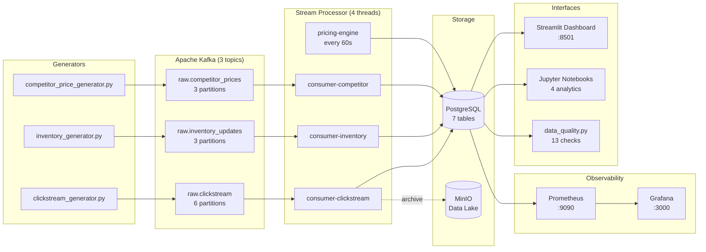

# Real-Time E-Commerce Pricing & Inventory Intelligence Platform

**A streaming data platform that monitors competitor prices, tracks inventory across 3 warehouses, and issues dynamic pricing recommendations — all in real time.**


---

## 🏗 Architecture



---

## The Business Problem

Online retail operates in a market where prices change hourly. Retailers who rely on manual price reviews — checking competitor sites weekly or adjusting prices at the end of a quarter — are making decisions with days-old information. The result is predictable: products priced 15% above the market sit unsold while the competition clears inventory, and products priced below their natural ceiling leave margin on the table with every transaction. At meaningful scale, static pricing is not just inefficient — it is a continuous, measurable revenue leak.

Inventory compounds the problem. Without real-time visibility into stock levels, operations teams react rather than plan. A product sells out on a Tuesday afternoon; no one knows until a customer hits an error page or a fulfilment team runs a daily batch report on Wednesday morning. Multiply that across 30 SKUs and 3 warehouses, and the organisation is perpetually surprised by its own stockouts. Meanwhile, the marketing team continues running paid acquisition to pages that cannot convert.

Competitor pricing data is typically the last piece to be solved — and the most valuable. Knowing that a single competitor is undercutting you on laptops by more than 10% while demand is weak is the difference between a 5-minute pricing decision and a lost sale. This platform was built to eliminate all three blind spots simultaneously: ingesting competitor prices the moment they change, reflecting inventory movements in real time, and running a pricing recommendation engine continuously — so that every stakeholder, from the pricing analyst to the warehouse manager, is working from the same live picture.

---

## What This Platform Does

- **Real-time clickstream processing** — captures page views, product views, add-to-cart, and purchase events at sub-second latency via Kafka
- **Dynamic pricing recommendations** — a rule-based engine runs every 60 seconds, comparing our prices to competitor averages and demand velocity to issue `raise`, `lower`, or `hold` recommendations with confidence scores
- **Inventory tracking across 3 warehouses** — WH-LAGOS, WH-ABUJA, and WH-PH; stock levels are updated atomically and guarded against negative values
- **Competitor price monitoring** — tracks 3 competitors (TechMart, GadgetZone, ElectroHub) across all 30 products, computing price-gap percentages in real time
- **Automated data quality checks** — 13 assertions run on demand across inventory, clickstream, competitor prices, and recommendation tables
- **Business analytics** — 4 Jupyter notebooks covering conversion funnel analysis, RFM customer segmentation, price elasticity simulation, and demand forecasting with inventory implications

---

## Tech Stack

| Technology | Version | Role |
|---|---|---|
| **Apache Kafka** | Confluent 7.5.0 | Message backbone — 3 topics, 12 total partitions |
| **Apache ZooKeeper** | Confluent 7.5.0 | Kafka broker coordination |
| **PostgreSQL** | 15 | Primary operational database — 7 tables, 4 indexes per hot table |
| **psycopg** | 3.x | Python PostgreSQL driver (psycopg3 — async-compatible) |
| **MinIO** | latest | S3-compatible local data lake for raw event archiving |
| **Prometheus** | latest | Metrics scraping and time-series storage (30-day retention) |
| **Grafana** | latest | Pipeline health dashboards, auto-provisioned from JSON |
| **Streamlit** | 1.32+ | Live business intelligence dashboard |
| **Python** | 3.11 | Stream processor, data generators, analytics, quality checks |
| **pandas** | 2.1+ | DataFrame transforms in the analytics layer |
| **Plotly** | 5.18+ | Interactive charts across dashboard and notebooks |
| **Jupyter** | — | Analytical notebooks for business reporting |
| **Docker Compose** | — | Single-command infrastructure orchestration |

---

## Quick Start

**Prerequisites:** Docker Desktop, Python 3.11+

### 1. Start the infrastructure

```bash
docker compose up -d
```

This brings up Kafka, ZooKeeper, PostgreSQL, MinIO, Prometheus, and Grafana. Topic creation and bucket initialisation are handled automatically by init containers.

Verify everything is healthy:

```bash
docker compose ps
```

### 2. Install Python dependencies

```bash
# Generators
pip install -r generators/requirements.txt

# Stream processor
pip install -r processing/requirements.txt

# Streamlit dashboard
pip install -r dashboards/requirements.txt

# Data quality
pip install -r quality/requirements.txt
```

### 3. Start the data generators

Open three terminal windows and run each generator:

```bash
# Terminal 1 — user clickstream events
python generators/clickstream_generator.py

# Terminal 2 — inventory stock movements
python generators/inventory_generator.py

# Terminal 3 — competitor price observations
python generators/competitor_price_generator.py
```

### 4. Start the stream processor

```bash
# Terminal 4
python processing/stream_processor.py
```

The processor starts 3 Kafka consumer threads and the pricing engine. You will see live throughput stats every 10 seconds:

```
[14:32:10] clickstream=1,240 (12.4/s) | inventory=418 (4.2/s) | competitor=183 (1.8/s) | recommendations=30
```

### 5. Open the dashboard

```bash
streamlit run dashboards/app.py
```

Navigate to **http://localhost:8501**

### 6. Run data quality checks

```bash
python quality/data_quality.py

# Verbose mode — shows SQL and raw counts for each check
python quality/data_quality.py --verbose
```

### 7. Generate the analytics notebooks

```bash
python analytics/build_price_elasticity.py
python analytics/build_rfm_segmentation.py
python analytics/build_demand_forecasting.py
python analytics/build_conversion_funnel.py
```

Then open any `.ipynb` in Jupyter and run all cells.

---

## Project Structure

```
ecommerce-pricing-intelligence/
│
├── docker-compose.yml              # Full infrastructure stack
│
├── database/
│   └── init.sql                    # Schema DDL + 30-product seed data
│
├── generators/
│   ├── catalog.py                  # Shared product catalog (30 SKUs, 5 categories)
│   ├── clickstream_generator.py    # Simulates user sessions → raw.clickstream
│   ├── inventory_generator.py      # Simulates stock movements → raw.inventory_updates
│   └── competitor_price_generator.py  # Simulates competitor scrapes → raw.competitor_prices
│
├── processing/
│   └── stream_processor.py         # 4-thread processor: 3 consumers + pricing engine
│
├── dashboards/
│   └── app.py                      # Streamlit BI dashboard
│
├── analytics/
│   ├── build_conversion_funnel.py  # Generates conversion_funnel.ipynb
│   ├── build_price_elasticity.py   # Generates price_elasticity.ipynb
│   ├── build_rfm_segmentation.py   # Generates rfm_segmentation.ipynb
│   ├── build_demand_forecasting.py # Generates demand_forecasting.ipynb
│   └── *.ipynb                     # Generated notebooks (not committed)
│
├── quality/
│   └── data_quality.py             # 13 automated data quality assertions
│
├── grafana/
│   └── provisioning/               # Auto-provisioned datasource + dashboard JSON
│
├── prometheus/
│   └── prometheus.yml              # Scrape configuration
│
└── dbt_models/
    └── placeholder.txt             # Reserved for dbt transformation layer
```

---

## Data Pipeline Architecture

### Kafka Topics

| Topic | Partitions | Retention | Producer | Consumer |
|---|---|---|---|---|
| `raw.clickstream` | 6 | 7 days | clickstream_generator | consumer-clickstream |
| `raw.inventory_updates` | 3 | 7 days | inventory_generator | consumer-inventory |
| `raw.competitor_prices` | 3 | 7 days | competitor_price_generator | consumer-competitor |

`raw.clickstream` has 6 partitions to handle peak session bursts without consumer lag. Topics are created by a one-shot `kafka-init` container at startup — `KAFKA_AUTO_CREATE_TOPICS_ENABLE` is explicitly disabled to prevent accidental topic creation.

### Stream Processor

The processor runs 5 concurrent threads under a shared `threading.Event` shutdown signal:

- **consumer-clickstream** — inserts events into `clickstream_events`, then upserts `product_metrics` (view count, cart adds, purchase count, conversion rate, revenue) in the same batch transaction
- **consumer-inventory** — logs to `inventory_events` and applies the stock delta to `inventory_state`; a guard clause prevents negative stock without raising an exception
- **consumer-competitor** — CTE-based upsert on `competitor_prices` (update if exists, insert if not), keyed on `(product_id, competitor_name)`
- **pricing-engine** — wakes every 60 seconds, reads all products, last-hour demand velocity, and latest competitor prices, then upserts a `raise`/`lower`/`hold` recommendation with a confidence score for every product that has competitor data
- **stats-printer** — logs per-second throughput for each stream every 10 seconds

All database writes use a `Batcher` class that accumulates operations and flushes them in a single transaction every 100 messages or 2 seconds, whichever comes first. This reduces round trips by ~100× compared to per-message commits.

### PostgreSQL Schema (7 tables)

| Table | Purpose | Key columns |
|---|---|---|
| `products` | Canonical product catalog | `product_id`, `category`, `base_price` |
| `inventory_state` | Live stock per product × warehouse | `current_stock` (CHECK ≥ 0) |
| `inventory_events` | Immutable audit log of stock movements | `quantity_change`, `warehouse_id` |
| `clickstream_events` | Raw event stream | `event_type`, `session_id`, `device_type` |
| `product_metrics` | Rolling KPIs per product | `total_views`, `conversion_rate`, `revenue` |
| `competitor_prices` | Latest price observations per competitor | `competitor_price`, `price_difference_pct` |
| `pricing_recommendations` | Pricing engine output | `recommendation`, `confidence_score`, `recommended_price` |

Every high-traffic table (`clickstream_events`, `inventory_events`, `competitor_prices`) carries indexes on `product_id`, `timestamp DESC`, and the primary filter column to support both the stream processor's point writes and the analytics notebooks' range scans without table scans.

---

## Analytics & Insights

All four notebooks are generated by their corresponding `build_*.py` scripts — the `.ipynb` files are build artefacts and are not version-controlled. Run any build script to regenerate the notebook from scratch.

### `conversion_funnel.ipynb` — Where do we lose users?

Measures unique sessions at each funnel stage (`page_view → product_view → add_to_cart → purchase`) and surfaces the step with the steepest drop-off. Breaks the funnel down by device type and product category. Session-level analysis compares converted vs non-converted visits on event count, session duration, and distinct event types — quantifying what a high-intent session looks like in real terms.

### `price_elasticity.ipynb` — Are we priced to win?

Compares our current price to the average competitor price for every product and plots the distribution of price gaps across all observations. The recommendation breakdown shows the current `raise`/`lower`/`hold` split with confidence scores. A competitor landscape heatmap reveals which competitor undercuts us most consistently, and on which products. A revenue simulation applies price elasticity (−1.5) to estimate the net revenue impact of following the engine's `lower` recommendations.

### `rfm_segmentation.ipynb` — Who are our best customers?

Calculates Recency, Frequency, and Monetary scores (1–5 quintile bins) for every user with at least one purchase. Maps score combinations to 7 named segments — Champions, Loyal Customers, Potential Loyalists, Big Spenders, At Risk, Lost, and Needs Attention — with per-segment revenue treemaps, radar charts, and preferred device breakdowns. Provides a direct input for campaign targeting and retention spend prioritisation.

### `demand_forecasting.ipynb` — What will demand look like in the next 6 hours?

Aggregates hourly purchase volumes by category, applies 1-hour and 3-hour moving averages, and produces a peak demand heatmap (hour of day × day of week). Ranks categories by total volume and coefficient of variation (demand consistency). Extrapolates 6 hours forward using Exponential Weighted Mean with a linear trend and 0.85 decay factor — no external forecasting libraries required. Connects forecast demand to current inventory to compute hours-until-stockout per product and flags Critical (<24h) and Warning (<72h) items.

---

## Observability

**Grafana** is available at **http://localhost:3000**. The `pipeline_health.json` dashboard is auto-provisioned at startup via the `provisioning/` directory and covers pipeline message throughput, consumer group lag, pricing engine cycle metrics, and database connection health.

**Prometheus** scrapes metrics at **http://localhost:9090** with 30-day TSDB retention. The `prometheus.yml` config defines the scrape targets for all platform components.

---

## Data Quality

`quality/data_quality.py` runs 13 assertions against the live database and exits with code `0` (all pass) or `1` (any fail), making it suitable for a CI pipeline or scheduled monitoring job.

| Group | Check | Expectation |
|---|---|---|
| **Inventory** | No negative stock | COUNT = 0 |
| **Inventory** | 90 inventory rows (30 products × 3 warehouses) | COUNT = 90 |
| **Inventory** | Stock ≤ 100,000 per warehouse slot | MAX ≤ 100,000 |
| **Clickstream** | Valid event types only | COUNT of unknowns = 0 |
| **Clickstream** | All product references resolve to known products | COUNT of orphans = 0 |
| **Clickstream** | No timestamps more than 5 minutes in the future | COUNT = 0 |
| **Clickstream** | Table is not empty | COUNT ≥ 1 |
| **Competitor Prices** | All prices are positive | COUNT of ≤ 0 = 0 |
| **Competitor Prices** | Price difference within ±80% | COUNT outside range = 0 |
| **Competitor Prices** | All competitor names in the known set | COUNT of unknowns = 0 |
| **Pricing Recommendations** | Values are `raise`, `lower`, or `hold` | COUNT of invalid = 0 |
| **Pricing Recommendations** | Confidence scores between 0 and 1 | COUNT out of range = 0 |
| **Pricing Recommendations** | All recommendations reference a valid product | COUNT of orphans = 0 |

---

## What I Would Change at Scale

**1. Replace local Kafka with a managed service**
Single-broker Kafka works for development but has no replication or fault tolerance. In production, Confluent Cloud or AWS MSK would provide multi-AZ replication, schema registry, and a managed connector ecosystem — without the operational overhead of running brokers.

**2. Add Apache Flink for complex event processing**
The current processor handles stateless per-event transforms well, but patterns like "detect a user who has added to cart 3 times without purchasing in the last 30 minutes" require stateful streaming. Flink's windowing and CEP primitives are the right tool for that, and its exactly-once semantics would replace the current idempotency workarounds.

**3. Kubernetes for container orchestration**
Docker Compose is fine locally, but scaling the stream processor to handle 10× traffic means running multiple instances of each consumer. Kubernetes with a Kafka-aware HPA would handle that automatically, and a Helm chart would make deployment reproducible across environments.

**4. dbt for the transformation layer**
The `dbt_models/` directory is already a placeholder for this. Today all analytical transforms live inside the Jupyter notebooks as raw SQL. Moving them to dbt gives version-controlled, tested, documented transformations that can be scheduled and monitored independently of the notebooks.

**5. Real S3 instead of MinIO**
MinIO faithfully emulates the S3 API and is excellent for local development. In production, replacing it with S3 (or GCS) gives lifecycle policies, cross-region replication, and native integration with Athena and Glue — enabling a proper data lakehouse layer on top of the raw event archives.

**6. CI/CD pipeline for data quality**
The 13 quality checks run manually today. The right production pattern is to run them on a schedule via Airflow or a cron job, publish results as Prometheus metrics, and alert on failures through Grafana. Adding the quality script to a GitHub Actions workflow would also gate any schema migration on a full check pass.

---

## Author

**Wally** — [github.com/aziscript](https://github.com/aziscript)
